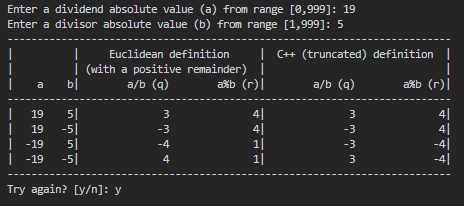

# C++ implementation of euclidean division 

### General info

Euclidean division implementation and comparsion with the C++ truncated definition (since C++11).

> This still leaves a sign ambiguity if the remainder is non-zero: two possible choices for the remainder occur, one negative and the other positive, and two possible choices for the quotient occur.
>
> **According to the number theory the positive remainder is always chosen** ([wiki](https://en.wikipedia.org/wiki/Modulo#math_1))

So, considering the positive remainder, the difference only occurs when $a < 0$. 

For $a ≥ 0$ the results are identical.

---

### How to use

Input absolute values, the resulting table will include all combinations of negative and positive quotients and remainders.

Example: \

---

### Related links

https://math.stackexchange.com/questions/4742061/is-it-possible-for-integer-division-in-c-to-express-a-compact-mathematical-con

https://en.wikipedia.org/wiki/Modulo

https://en.wikipedia.org/wiki/Euclidean_division

http://www.cristinagreen.com/tag/c.html

https://langdev.stackexchange.com/questions/259/distinguishing-modulo-euclidean-division-from-remainder

https://copyprogramming.com/howto/why-does-c-output-negative-numbers-when-using-modulo